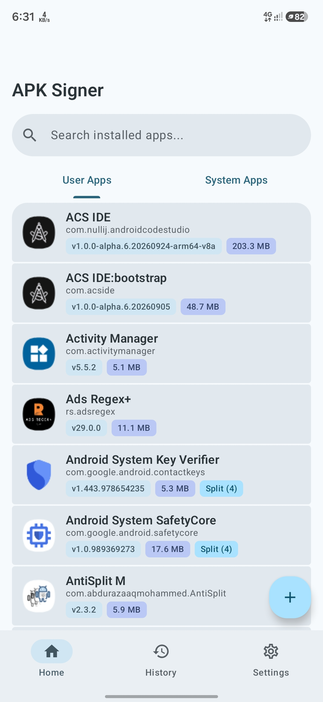
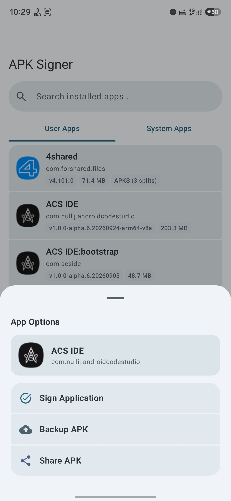
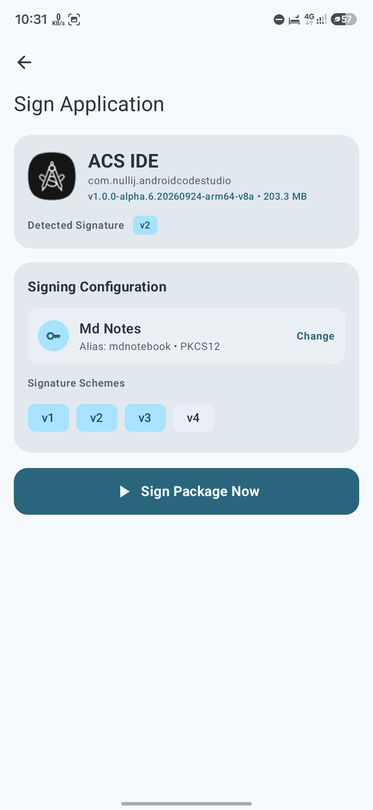
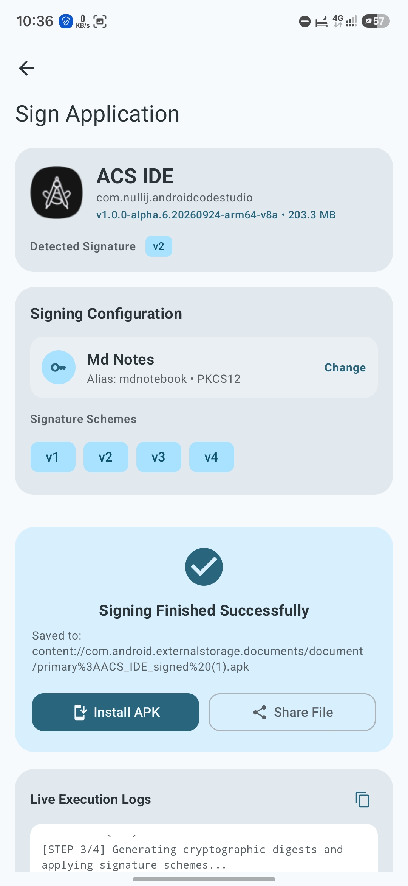
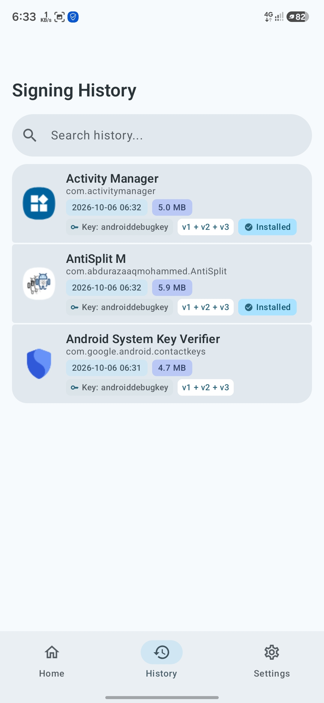
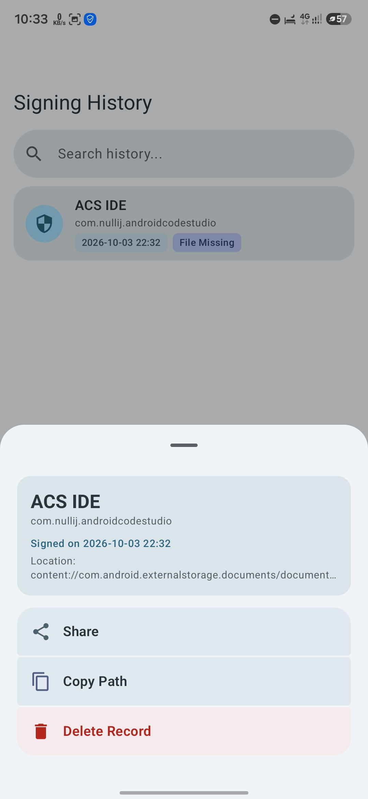
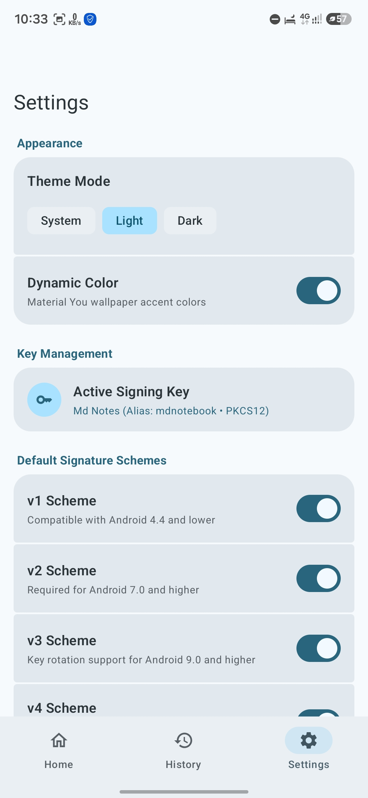
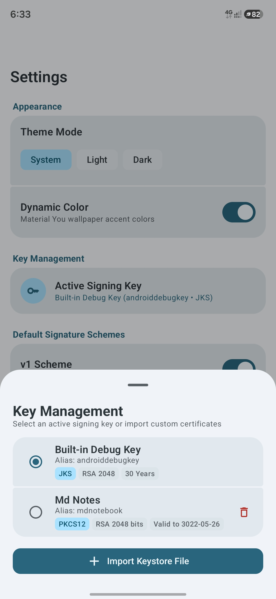

# APK Signer Pro (Material 3 Expressive)

An open-source, modern Android application for signing, verifying, extracting, backing up, and managing APK, APKS, and XAPK package files directly on Android devices using pure Kotlin and Jetpack Compose.

---

## 📸 Screenshots

<table>
  <tr>
    <td width="50%"></td>
    <td width="50%"></td>
  </tr>
  <tr>
    <td width="50%"></td>
    <td width="50%"></td>
  </tr>
  <tr>
    <td width="50%"></td>
    <td width="50%"></td>
  </tr>
  <tr>
    <td width="50%"></td>
    <td width="50%"></td>
  </tr>
</table>

---

## ✨ Key Features

- **v1 APK Signing**: Legacy JAR-based APK signing for older Android versions.
- **v2 APK Signing & Verification**: Full-file binary integrity protection for Android 7.0+.
- **v3 APK Signing & Verification**: Key rotation and cryptographic lineage support for Android 9.0+.
- **v4 APK Signing**: Streaming signature generation with `.apk.idsig` support for Android 11.0+.
- **16KB & 4KB Page Alignment**: Automatically aligns native `.so` libraries and `resources.arsc` for modern Android compatibility.
- **Multi-Format Keystores**: Supports `JKS`, `PKCS12`, `BKS`, `BKS-V1`, `UBER`, and `BCFKS`.
- **Built-in Debug Key**: Sign APKs instantly using the standard Android Studio debug credentials.
- **Certificate Inspection**: View certificate algorithm, validity period, subject, issuer, and SHA-256 fingerprint before saving a keystore.
- **Persistent Credentials**: Associates passwords with saved key records for faster signing without repeated prompts.
- **APK Backup & Extraction**: Back up and extract APKs from installed user and system applications.
- **Split APK Support**: Handle split APK bundles and `.apks` packages.
- **APK & Package Management**: Install, share, copy paths, or remove generated files directly from the application.
- **APK, APKS & XAPK Support**: Designed to work with common Android package formats.
- **Signing History**: Store and manage previous signing operations locally.
- **Search & Filtering**: Quickly find records across signing history and installed applications.
- **Reactive Local Storage**: SQLite persistence with Kotlin Flow for responsive data updates.
- **Organized File Storage**: Automatically stores backups and signed packages in dedicated directories under `Downloads/APKSigner/`.
- **Secure Installation & Sharing**: Uses Android's `FileProvider` and system sharesheet for secure file handling.

---

## 🎨 Material 3 Expressive UI

- **Material 3 Expressive**: Modern Android interface built entirely with Jetpack Compose.
- **Dynamic Colors**: Automatically adapts to the system wallpaper color palette.
- **Light & Dark Themes**: Full support for system-based Light and Dark themes.
- **Collapsing Top App Bars**: Smooth nested scrolling across primary screens.
- **Live Terminal Logs**: Colorized signing and execution logs with step indicators.
- **One-Tap Log Copying**: Quickly copy terminal output to the clipboard.
- **Responsive Layouts**: Designed for a clean and consistent experience across Android devices.

---

## ☕ Support the Project

If APK Signer Pro is useful to you, you can support its development by buying me a coffee.

You can also connect with me on Telegram:

---

## 🙏 Acknowledgements

Special thanks to the **ACS Lite team** for making Android development possible directly on mobile. This project was developed using their latest Android development environment, enabling the entire application to be built without a computer.

---

## 📄 License

This project is licensed under the Apache 2.0 License.